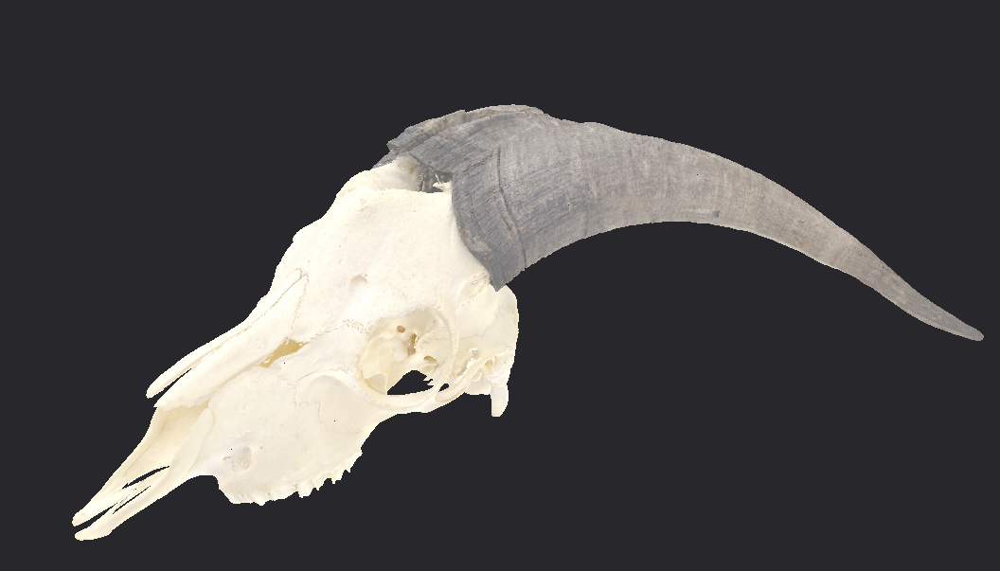

**Triad** is a modular GPU rendering framework / application for use in real-time splatting.
Aims to become a complete autonomy tool/sim.

[ROADMAP](./ROADMAP.md)

## Crates

- **`triad-data`**: Data loading helpers (PLY files)
- **`triad-gpu`**: Low-level GPU rendering infrastructure built on wgpu
- **`triad-window`**: Window management and application framework (winit)

## Resources
- [Triangle Splatting+](https://arxiv.org/abs/2509.25122)
- [3DGS Real-Time Radiance Field Rendering](https://arxiv.org/abs/2308.04079)
- [4D Gaussian Splatting Research](./docs/4d_gaussian_research.md)
